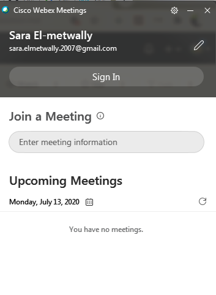
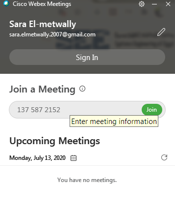
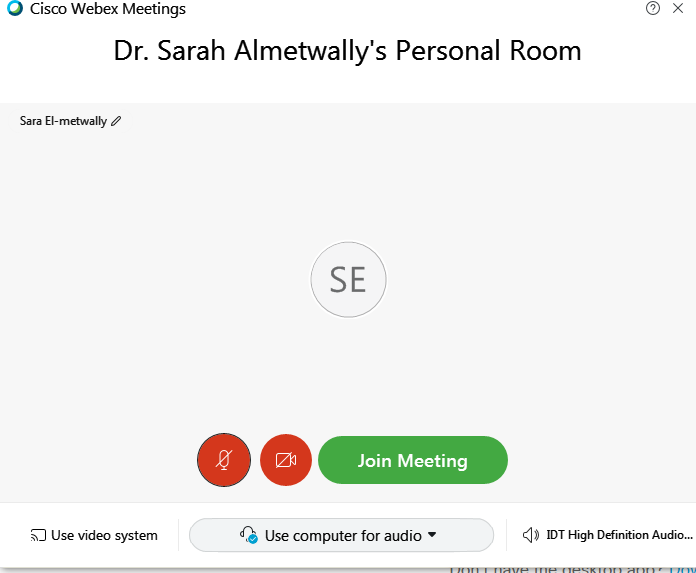
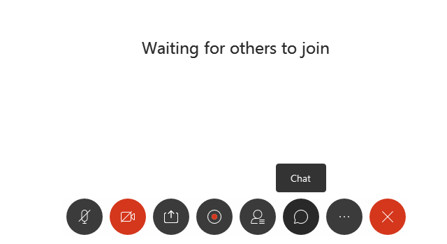
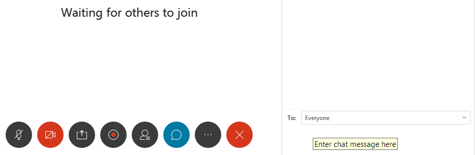
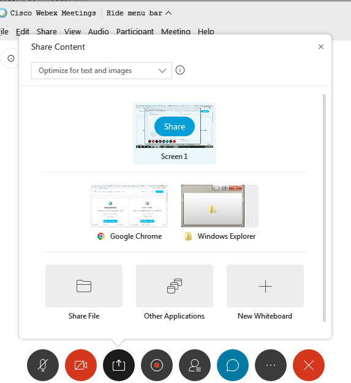
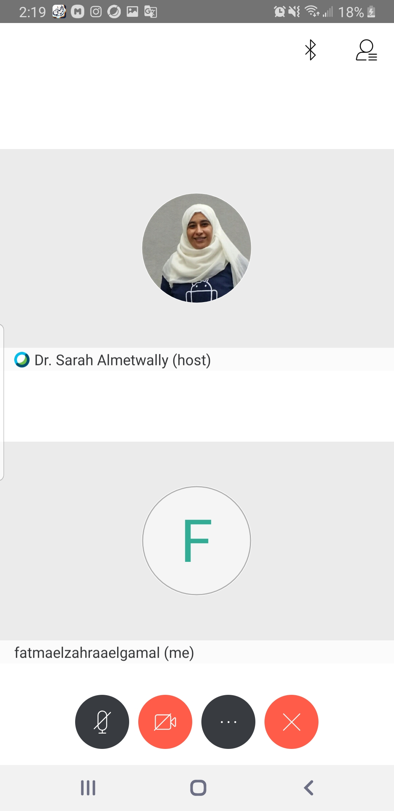
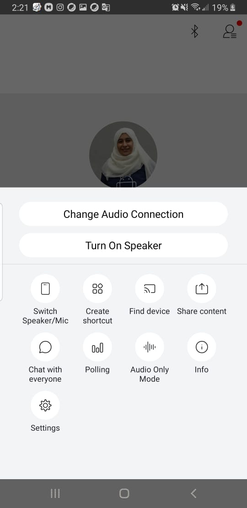

### Software requirements
1. Go to <a href="https://www.webex.com/downloads.html"> Webex Meetings </a> and download it.
2. After installing Cisco Webex Meetings, you can sign in by your email if you have a previous account or join as a guest by write your email and your displayed name.
3. The following window will ask you about the meeting information.
 
 
 
4. The meeting host will send you a number that represents the meeting information. 
 
  
 
5. The following window will appear to you to join the meeting. 
 
  
 
6. Make sure that you adjust your camera, microphone, etc. (mute/unmute them properly according to your needs).
 
7. I recommend to mute the microphone and unmute it if you have a questions or you want to interrupt the instructor. 
 
8. After you join the meeting, the set of participants will appear to you and you can chat with them too by clicking on Chat icon on the bottom of the Webex Meetings window.
 
  
 
  
9. You can share your screen, your opened windows, files, folders, apps, etc. through Share content icon. If you share your screen, the tool bar will appear on the top of your screen to control the sharing process. 
 
 
10. If you have any trouble with joining the meeting through the Webex Meetings Desktop app, you can join the meeting through the web browser.
 
 
11. The mobile application version of the Webex Meetings have the same functionality with different looks.
 
  
 
  

 
