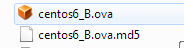
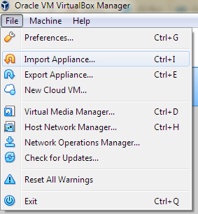
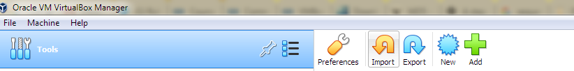
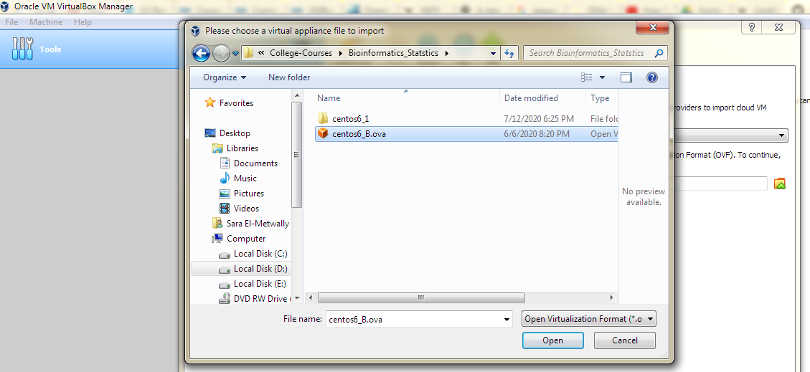
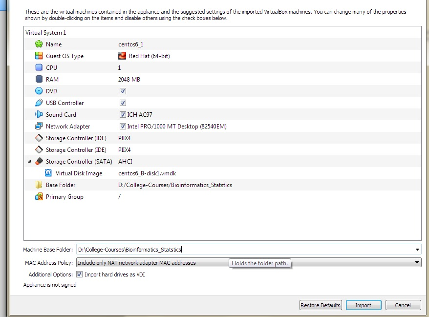
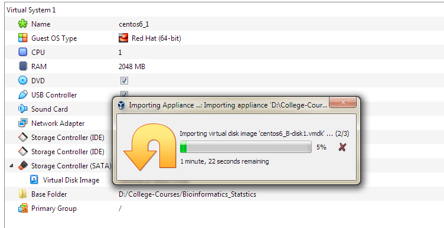
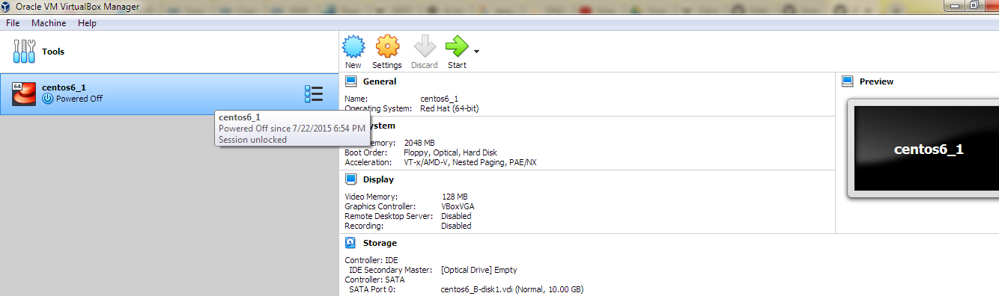
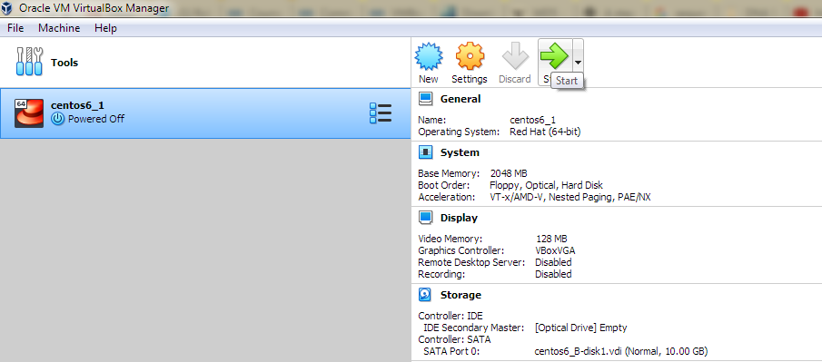
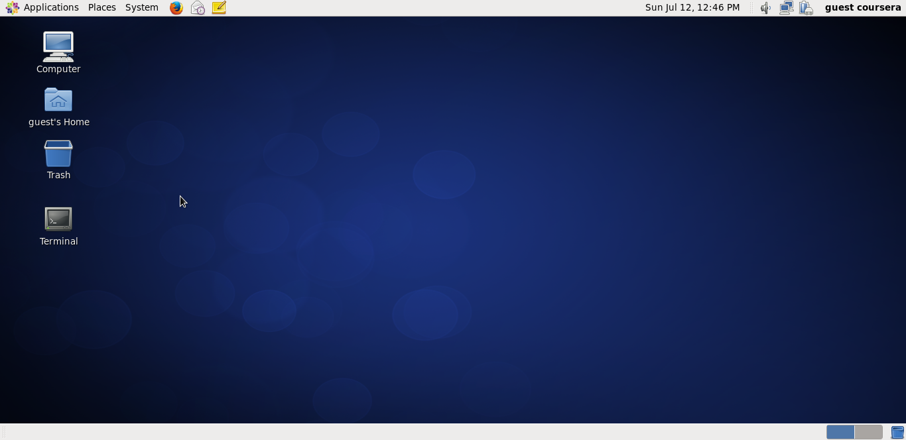

## Software requirements
<ul>
  <li> Downlod the file <a href="https://drive.google.com/file/d/1xZ5i9Rc0bPgqkb7mqEqj1fWUNf2J6PxL/view?usp=sharing"> <b> centos6_B.ova </b></a> .</li>
  <li> Download the file <a href="https://drive.google.com/file/d/1N56BTgcKwpWlC_NZPfH9Iy6vg3iFTGTj/view?usp=sharing"> <b> centos6_B.ova.md5 </b></a> .</li>
  <li> Download the correct version of <a href="https://www.virtualbox.org/wiki/Downloads"><b> VirtualBox </b></a> according to your operating system. </li>
</ul>

### Notes
<b> centos6_B.ova </b> is a linux-based (i.e. <a href="https://en.wikipedia.org/wiki/CentOS"> <b> Centos 6.6 operating system</b><a>) vitual machine with some installed bioinformatics tools created through Johns Hopkins Genomic Data Science Specialization Courses <a href="https://www.coursera.org/learn/genomic-tools/supplement/OyZzQ/vmbox-download-instructions"> <b> ( Course Name: Command Line Tools for Genomic Data Science)  </b> </a> @ Coursera and all credits go to them. 
  
  ## Setup our Working Environment 
  1. Make sure that you have enough space on your computer, and choose a partition that has at least 3 GB free space to save <b> centos6_B.ova </b>
  
  2. Go to your installed Oracle VM VirtualBox and open it. 
  
  3. Go to File/Import Appliance or Click on Tools and click on Import.
   
  
  4. Choose the location of the file <b> centos6_B.ova </b>.
  
  5. You can change the Machine base folder or Restore Defaults.
  
  6. Click import. 
  
  After a sucessful importing of a virtual machine, the following window will appear:
  
  7. Click on start button. 
  
  The following window will appear after starting the linux Centos 6.6 operating system.
  
  
  
  
  
  
  
 
  
